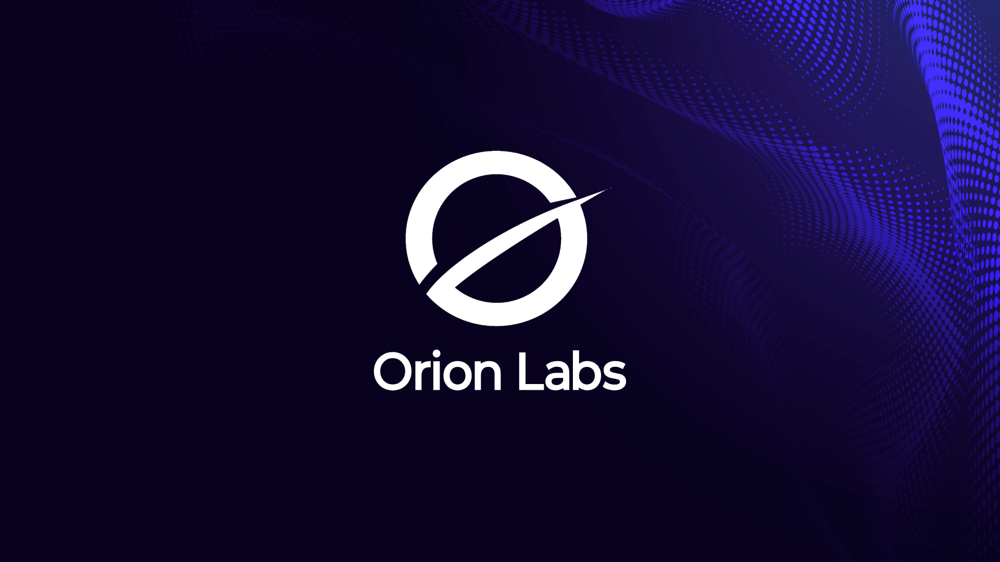

# Orion Launcher

**The official Orion NVR Launcher developed by ORION LABS.**

</a>

| Main screen | Settings | OrionLabs |
|:---:|:---:|:---:|
|  |  |  |

---

Acerca de

  
## Acerca de

- Orion Launcher es el entorno de inicio propietario y oficial desarrollado para impulsar el ecosistema OrionUI, diseñado exclusivamente para funcionar de manera optimizada en el dispositivo NVR ORION.
Reconstruido y basado en Couchy Launcher para Android TV, Orion Launcher prioriza el rendimiento, la estabilidad y la fluidez de navegación, eliminando el consumo innecesario de recursos para ofrecer una experiencia limpia, inmediata y libre de distracciones.

---
  
## Nuevas funciones

- New: Five new icons for the launcher's internal interface.
- New: New way added to set the launcher as default using accessibility services.

---

## Requisitos

- **Android TV or Google TV** (requires the `leanback` feature.
- **Android 5.0 (Lollipop) or newer** — the whole Android TV lineage.
- **ARM (32- or 64-bit)**
- **No dependencies** — no companion app and **no Google Play Services** required; runs on AOSP boxes too.
- Driven entirely by the **remote / D-pad**; no touchscreen needed.

---

## Privacidad 

Sin anuncios, Sin Analítica , El servicio de Accesibilidad es opcional pero puede que no funcione ( Establecer Launcher Predeterminado mediante Accesibilidad ).

